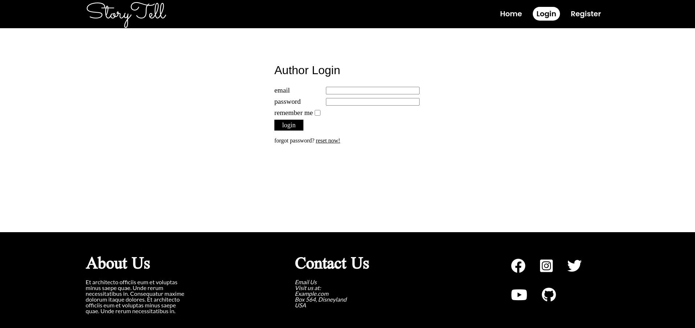
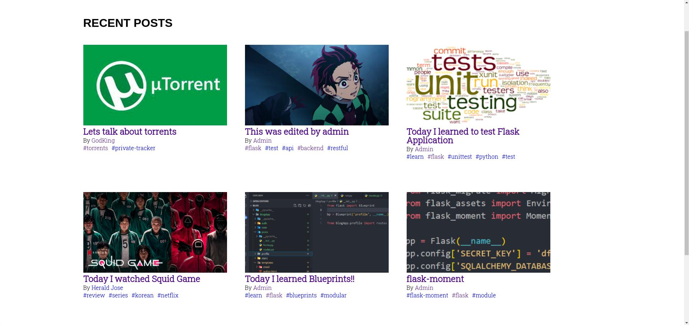
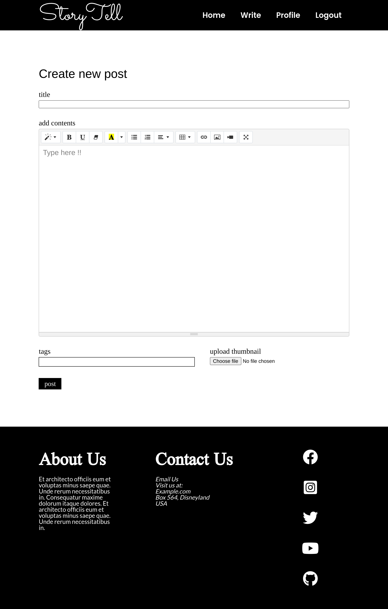
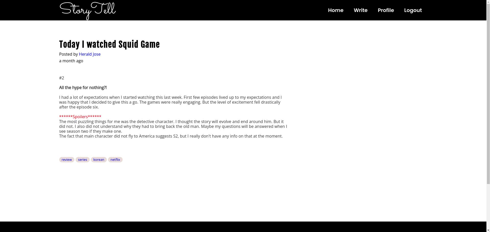
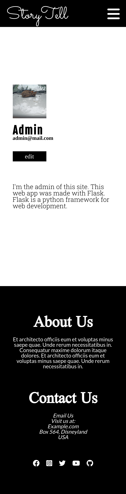
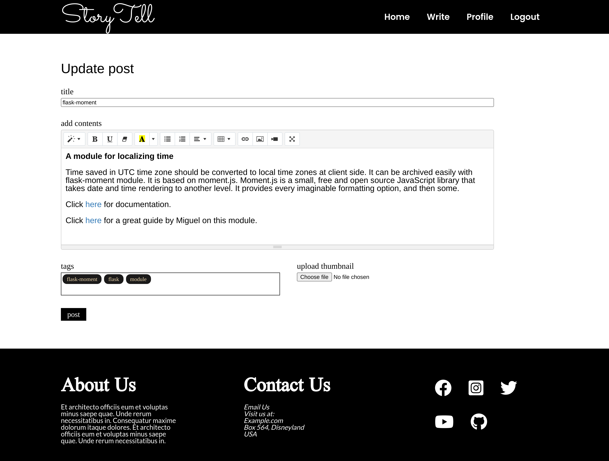
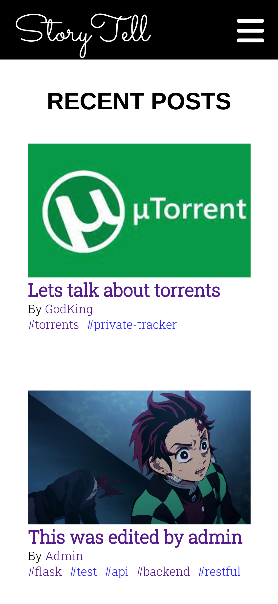

# StoryTell

A blogging webapp made using `Flask`

## Usage

* Install `requirements.txt`

>```pip install -r requirements.txt```

* Set all the environment variables in `config.py`

* Set up database

>```flask create_db```

* Run `run.py` file

>```python3 run.py```

## Key functionalities

* Authors can sign up and sign in
* Authors can write blogs in a richtext area. I used [summernote](https://summernote.org/) and bleached unwanted tags using [bleach](https://pypi.org/project/bleach/)
* Passwords can be reset with password reset mails. This was done using [PyJWT](https://pyjwt.readthedocs.io/en/latest/)
* Tags and thumbnail can be added to each blogs and can be edited later. Blogs can be filtered using tags
* Authors can customize their profiles

## Screenshots







